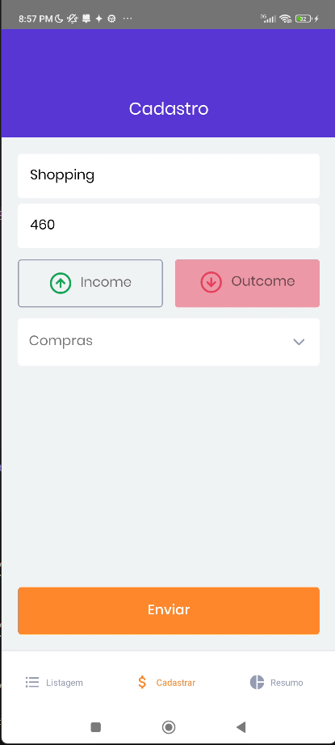
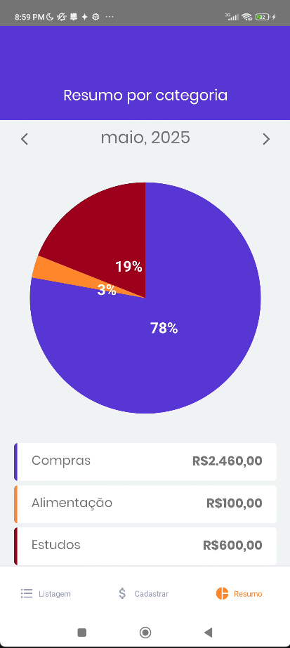

# GoFinances - Personal Finance Management App


## 📱 About the Project

GoFinances is a modern and intuitive personal finance management application built with React Native. It helps users track their expenses and income, visualize their financial data through interactive charts, and manage their personal finances effectively.

## ✨ Features

- 📊 Interactive expense charts using Victory Native
- 🔐 Secure authentication with Google and Apple Sign-In
- 💰 Track income and expenses
- 📈 Visualize financial data through graphs
- 🎨 Modern and intuitive user interface
- 📱 Cross-platform (iOS and Android)

## 🚀 Technologies

- React Native
- TypeScript
- Victory Native (for charts)
- Google Authentication
- Apple Authentication
- AsyncStorage
- React Navigation
- Styled Components

## 🛠️ Installation

1. Clone the repository:
```bash
git clone https://github.com/stephenrk/gofinances.git
```

2. Install dependencies:
```bash
cd gofinances
npm install
# or
yarn install
```

3. Install iOS dependencies (iOS only):
```bash
cd ios
pod install
```

4. Start the application:
```bash
# For iOS
npm run ios
# or
yarn ios

# For Android
npm run android
# or
yarn android
```

## 📱 Screenshots

<div align="center">
  
  
  
  
</div>

## 🎯 Features in Detail

### Authentication
- Secure login using Google or Apple authentication
- Persistent session management
- Secure token storage

### Dashboard
- Overview of total balance
- Recent transactions
- Quick access to main features

### Transactions
- Add new income or expenses
- Categorize transactions
- View transaction history
- Filter and search transactions

### Charts and Analytics
- Interactive pie charts for expense categories
- Monthly expense trends
- Income vs. expenses comparison

## 📝 License

This project is licensed under the MIT License - see the [LICENSE](LICENSE) file for details.


## 🙏 Acknowledgments

- [Rocketseat](https://rocketseat.com.br/) for the amazing learning platform
- [Victory Native](https://formidable.com/open-source/victory/docs/native/) for the charting library
- All contributors who have helped this project grow 